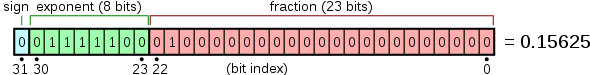

# Lecture 1: Floating Point Numbers

## Rounding Errors in Programming

- Infinite amount of numbers but finite amount of bits to represent them
- These small errors will accumulate and cause problems

### Why is this relevant in ML?

- large datasets with millions of params
- small errors can accumulate and cause problems

### Binary Numbers and Integers

- Binary numbers are represented as a sum of powers of 2
- e.g. 104 in binary is 1101000 = $1(2^6) + 1(2^5) + 0(2^4) + 1(2^3) + 0(2^2) + 0(2^1) + 0(2^0) = 64 + 32 + 8 = 104$
- **Unsigned Integers**: $2^n - 1$ is the largest number that can be represented with n bits
  - e.g. 8 bits can represent 0 to 255
  - `np.iinfo(np.uint8)` gives the min and max values
- **Signed Integers**: $2^{n-1} - 1$ is the largest positive number that can be represented with n bits
  - $-2^{n-1}$ is the smallest negative number that can be represented with n bits
  - e.g. 8 bits can represent -128 to 127 (0 is included in the positive numbers)
  - 1 bit is used to represent the sign
  - `np.iinfo(np.int8)` gives the min and max values

### Fractional Numbers in Binary

- 14.75 in binary is 1110.11

| 2^3 | 2^2 | 2^1 | 2^0 | 2^-1 | 2^-2 |
| --- | --- | --- | --- | ---- | ---- |
| 1   | 1   | 1   | 0   | 1    | 1    |
| 8   | 4   | 2   | 0   | 0.5  | 0.25 |

$ 8 + 4 + 2 + 0 + 0.5 + 0.25 = 14.75 $

### Fixed Point Numbers

- We typically have a fixed number of bits to represent the fractional part
- e.g. 8 bits total, 4 bits for the integer part and 4 bits for the fractional part
  - max value is 15.9375 ($2^3 + 2^2 + 2^1 + 2^0 + 2^{-1} + 2^{-2} + 2^{-3} + 2^{-4}$)
    - overflow if try a higher value
  - min value (bigger than 0) is 0.0625 ($2^{-4}$)
    - or precision of 0.0625 (any less => underflow)

### \*Floating Point Numbers\*

- Rather than having a fixed location for the binary point, we let it "float" around.
  - like how we write 0.1234 as 1.234 x 10^-1
- **Format**: $$(-1)^S \times 1. M \times 2^E$$
  - S is the sign bit
  - M is the mantissa, always between 1 and 2 (1.0 is implied)
  - E is the exponent

_Float 64_ (double precision)


_Float 32_ (single precision)


### Rounding Errors and Spacing

#### Spacing

- The spacing changes depending on the floating point number (because of the exponent)

##### Ways to calculate the spacing

```python
import numpy as np

np.spacing(1e16) # 1.0

np.nextafter(1e16, 2e16) - 1e16 # 1.0
```

### Examples

- `1.0 + 2.0 + 3.0 == 6.0` True
- `0.1 + 0.2 == 0.3` False
  - 0.1, 0.2, and 0.3 are not exactly representable in binary
- `1e16 + 1 == 1e16` True
  - 1 is less than the spacing, so it is rounded back
- `1e16 + 2.0 == 1e16` False
  - 2.0 is greater than the spacing, so it is rounded up
- `1e16 + 1.0 + 1.0  == 1e16` True
  - 1.0 is less than the spacing, so it is rounded back, then 1.0 is added, which is less than the spacing, so it is rounded back again
