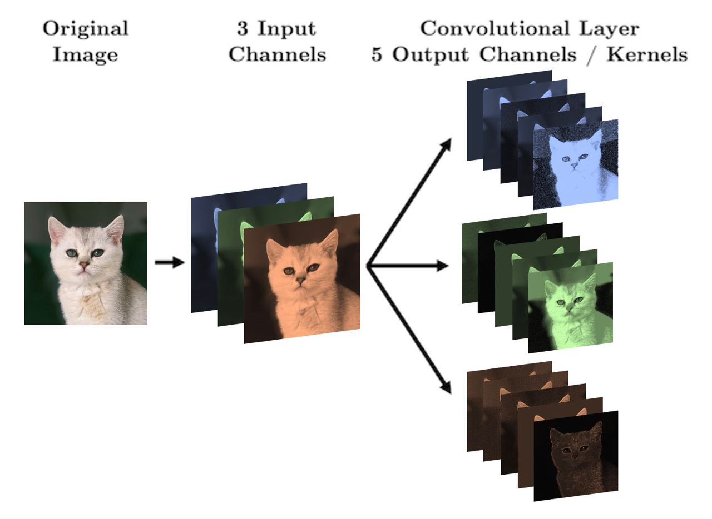

# Lecture 6: CNN

## Convolutional Neural Networks (CNN)


- Drastically reduces the number of params (compared to NN):
  - have activations depend on small number of inputs
  - same parameters (convolutional filter) are used for different parts of the image

### Convolution

- Idea: use a small filter/kernel to extract features from the image
  - Filter: a small matrix of weights


- Notice that the filter results in a smaller output image
  - This is because we are not padding the image
  - We can add padding to the image to keep the same size
    - Padding: add zeros around the image
  - Can also add stride to move the filter more than 1 pixel at a time

### CNN Structure


_[img src](https://towardsdatascience.com/a-comprehensive-guide-to-convolutional-neural-networks-the-eli5-way-3bd2b1164a53)_

### CNN in PyTorch

#### 1. Convolutional Layer

```python
conv_1 = torch.nn.Conv2d(in_channels=1, out_channels=6, kernel_size=(3,3))
```

- Arguments:
  - `in_channels`: number of input channels (gray scale image has 1 channel, RGB has 3)
  - `out_channels`: number of output channels (similar to hidden nodes in NN)
  - `kernel_size`: size of the filter
  - stride: how many pixels to move the filter each time
  - padding: how many pixels to add around the image



- Size of input image (e.g. 256x256) doesn't matter, what matters is: `in_channels`, `out_channels`, `kernel_size`

$$\text{total params} = (\text{out channels} \times \text{in channels} \times \text{kernel size}^2) + \text{out channels}$$

$$\text{output size} = \frac{\text{input size} - \text{kernel size} + 2 \times \text{padding}}{\text{stride}} + 1$$

##### Dimensions of images and kernel tensors in PyTorch

- Images: `[batch_size, channels, height, width]`
- Kernel: `[out_channels, in_channels, kernel_height, kernel_width]`

Note: before passing the image to the convolutional layer, we need to reshape it to the correct dimensions. Also if you want to `plt.imshow()` the image, you need to reshape it back to `[height, width, channels]`.

#### 2. Flattening

- See the diagram above, its to go from `feature learning` -> `classification`
- At the end need to either do regression or classification

#### 3. Pooling

- IDea: reduce the size of the image
  - less params
  - less overfitting
- Common types:
  - **Max pooling**: take the max value in each region
    - Works well since it takes the sharpest features
  - **Average pooling**: take the average value in each region

#### Putting it all together

```python
class CNN(torch.nn.Module):
    def __init__(self):
        super().__init__()
        self.main = torch.nn.Sequential(

            torch.nn.Conv2d(in_channels=1,
                out_channels=3,
                kernel_size=(3, 3),
                padding=1),
            torch.nn.ReLU(),
            torch.nn.MaxPool2d((2, 2)),

            torch.nn.Conv2d(in_channels=3,
                out_channels=2,
                kernel_size=(3, 3),
                padding=1),
            torch.nn.ReLU(),
            torch.nn.MaxPool2d((2, 2)),

            torch.nn.Flatten(),
            torch.nn.Linear(1250, 1)
        )

    def forward(self, x):
        out = self.main(x)
        return out
```
