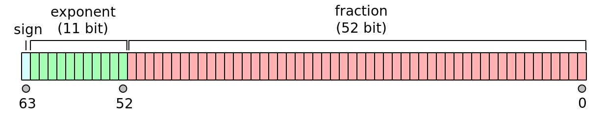
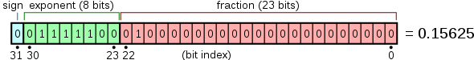
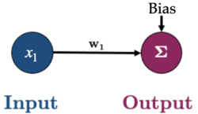
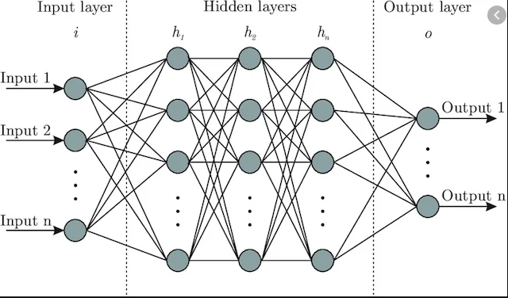
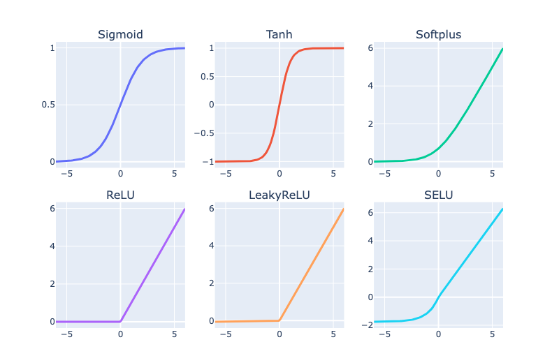

# 572 Quiz 1 CS

## Rounding Errors in Programming

- Infinite amount of numbers but finite amount of bits to represent them
- These small errors will accumulate and cause problems

### Why is this relevant in ML?

- large datasets with millions of params
- small errors can accumulate and cause problems

### Binary Numbers and Integers

- Binary numbers are represented as a sum of powers of 2
- e.g. 104 in binary is 1101000 = $1(2^6) + 1(2^5) + 0(2^4) + 1(2^3) + 0(2^2) + 0(2^1) + 0(2^0) = 64 + 32 + 8 = 104$
- **Unsigned Integers**: $2^n - 1$ is the largest number that can be represented with n bits
  - e.g. 8 bits can represent 0 to 255
  - `np.iinfo(np.uint8)` gives the min and max values
- **Signed Integers**: $2^{n-1} - 1$ is the largest positive number that can be represented with n bits
  - $-2^{n-1}$ is the smallest negative number that can be represented with n bits
  - e.g. 8 bits can represent -128 to 127 (0 is included in the positive numbers)
  - 1 bit is used to represent the sign
  - `np.iinfo(np.int8)` gives the min and max values

### Fractional Numbers in Binary

- 14.75 in binary is 1110.11

| 2^3 | 2^2 | 2^1 | 2^0 | 2^-1 | 2^-2 |
| --- | --- | --- | --- | ---- | ---- |
| 1   | 1   | 1   | 0   | 1    | 1    |
| 8   | 4   | 2   | 0   | 0.5  | 0.25 |

$ 8 + 4 + 2 + 0 + 0.5 + 0.25 = 14.75 $

### Fixed Point Numbers

- We typically have a fixed number of bits to represent the fractional part
- e.g. 8 bits total, 4 bits for the integer part and 4 bits for the fractional part
  - max value is 15.9375 ($2^3 + 2^2 + 2^1 + 2^0 + 2^{-1} + 2^{-2} + 2^{-3} + 2^{-4}$)
    - overflow if try a higher value
  - min value (bigger than 0) is 0.0625 ($2^{-4}$)
    - or precision of 0.0625 (any less => underflow)

### \*Floating Point Numbers\*

- Rather than having a fixed location for the binary point, we let it "float" around.
  - like how we write 0.1234 as 1.234 x 10^-1
- **Format**: $$(-1)^S \times 1. M \times 2^E$$
  - S is the sign bit
  - M is the mantissa, always between 1 and 2 (1.0 is implied)
  - E is the exponent

_Float 64_ (double precision)


_Float 32_ (single precision)


### Rounding Errors and Spacing

#### Spacing

- The spacing changes depending on the floating point number (because of the exponent)

##### Ways to calculate the spacing

```python
import numpy as np

np.spacing(1e16) # 1.0

np.nextafter(1e16, 2e16) - 1e16 # 1.0
```

### Examples

- `1.0 + 2.0 + 3.0 == 6.0` True
- `0.1 + 0.2 == 0.3` False
  - 0.1, 0.2, and 0.3 are not exactly representable in binary
- `1e16 + 1 == 1e16` True
  - 1 is less than the spacing, so it is rounded back
- `1e16 + 2.0 == 1e16` False
  - 2.0 is greater than the spacing, so it is rounded up
- `1e16 + 1.0 + 1.0  == 1e16` True
  - 1.0 is less than the spacing, so it is rounded back, then 1.0 is added, which is less than the spacing, so it is rounded back again

## Optimization

- In ML, we want to minimize a loss function
  - typically a sum of losses over the training set
- Can think of ML as a 3 step process:
  1. Choose **model**: controls space of possible functions that map X to y
  2. Choose **loss function**: measures how well the model fits the data
  3. Choose **optimization** algorithm: finds the best model

### Optimization Terminology

- **Optimization**: process to min/max a function
- **Objective Function**: function to be optimized
- **Domain**: set to search for optimal value
- **Minimizer**: value that minimizes the objective function

### Loss Function

Common loss function is MSE (mean squared error):

$$L(w) = \frac{1}{n} \sum_{i=1}^n (\hat{y}_i - y_i)^2$$

Using a simple linear regression model $y = w_0 + w_1x$, we can rewrite the loss function as:

$$L(w) = \frac{1}{n} \sum_{i=1}^n ((w_0 + w_1x_i) - y_i)^2$$

So optimization is finding the values of $w_0$ and $w_1$ that minimize the loss function, $L(w)$.

In vector format:

$$\text{MSE} = \mathcal{L}(\mathbf{w}) = \frac{1}{n}\sum^{n}_{i=1}(\mathbf{x}_i \mathbf{w} - y_i)^2$$

In full-matrix format

$$\text{MSE} = \mathcal{L}(\mathbf{w}) = \frac{1}{n}(\mathbf{X} \mathbf{w} - \mathbf{y})^T (\mathbf{X} \mathbf{w} - \mathbf{y}) $$

### Notation

$$
\mathbf{y}=
\left[
\begin{array}{c} y_1 \\
\vdots \\
y_i \\
\vdots\\
y_n
\end{array}
\right]_{n \times 1}, \quad
\mathbf{X}=
\left[
\begin{array}{c} \mathbf{x}_1 \\
\vdots \\
\mathbf{x}_i \\
\vdots\\
\mathbf{x}_n
\end{array}
\right]_{n \times d}
= \left[\begin{array}{cccc}
x_{11} & x_{12} & \cdots & x_{1 d} \\
\vdots & \vdots & \ddots & \vdots \\
x_{i 1} & x_{i 2} & \cdots & x_{i d}\\
\vdots & \vdots & \ddots & \vdots \\
x_{n 1} & x_{n 2} & \cdots & x_{n d}
\end{array}\right]_{n \times d},
\quad
\mathbf{w}=
\left[
\begin{array}{c} w_1 \\
\vdots\\
w_d
\end{array}
\right]_{d \times 1}
$$

- $n$: number of examples
- $d$: number of input features/dimensions

The goal is to find the weights $\mathbf{w}$ that minimize the loss function.

**Formulas:**

$$\mathbf{y} = \mathbf{X} \mathbf{w}$$

$$\hat{\mathbf{y}_i} = \mathbf{w}^T \mathbf{x}_i$$

## Gradient Descent

- One of the most important optimization algorithms in ML
- Iterative optimization algorithm
- Steps:

  1. start with some arbitrary $\mathbf{w}$

  2. calculate the gradient using all training examples
  3. use the gradient to adjust $\mathbf{w}$
  4. repeat for $I$ iterations or until the step-size is sufficiently small

- Cost: $O(ndt)$ for t iterations, better than brute force search $O(nd^2 + d^3)$

$$w_{t+1} = w_t - \alpha \nabla= L(w_t)$$

- $w_t$: current value of the weights
- $\alpha$: learning rate
- $\nabla L(w_t)$: gradient of the loss function at $w_t$

### GD with a Single Parameter

- Loss function: $L(w) = \frac{1}{n} \sum_{i=1}^n (\hat{y}_i - y_i)^2$
- Gradient: $\nabla L(w) = \frac{d}{dw} L(w) = \frac{2}{n} \sum_{i=1}^n x_{i1} (x_{i1} w_1 - y_i)$
  - Or in Matrix form: $\nabla L(w) = \frac{2}{n} \mathbf{X}^T (\mathbf{X} \mathbf{w} - \mathbf{y})$

### GD with Multiple Parameters

- Need to scale for the contour plot to be more "round"

  - better for gradient descent

- In real life, contour plots are not so nice

### General process



- **Initialization:** Start with an initial set of parameters, often randomly chosen.
- **Forward pass:** Generate predictions using the current values of the parameters. (E.g., $\hat{y_i} = x_{1}w_1 + Bias$ in the toy example above)
- **Loss calculation:** Evaluate the loss, which quantifies the discrepancy between the model's predictions and the actual target values.
- **Gradient calculation:** Compute the gradient of the loss function with respect to each parameter either on a batch or the full dataset. This gradient indicates the direction in which the loss is increasing and its magnitude.
- **Parameter Update**: Adjust the parameters in the opposite direction of the calculated gradient, scaled by the learning rate. This step aims to reduce the loss by moving the parameters toward values that minimize it.

### Other Optimization Algorithms

- Use `minimize` function from `scipy.optimize`

```python
from scipy.optimize import minimize

def mse(w, X, y):
    """Mean squared error."""
    return np.mean((X @ w - y) ** 2)

def mse_grad(w, X, y):
    """Gradient of mean squared error."""
    n = len(y)
    return (2/n) * X.T @ (X @ w - y)

out = minimize(mse, w, jac=mse_grad, args=(X_scaled_ones, toy_y), method="BFGS")
# jac: function to compute the gradient (optional)
# - will use finite difference approximation if not provided
```

- Other methods:
  - `BFGS`: Broyden–Fletcher–Goldfarb–Shanno algorithm
  - `CG`: Conjugate gradient algorithm
  - `L-BFGS-B`: Limited-memory BFGS with bounds on the variables
  - `SLSQP`: Sequential Least SQuares Programming
  - `TNC`: Truncated Newton algorithm

## Stochastic Gradient Descent

- Instead of updating our parameters based on a gradient calculated using all training data, we simply use **one of our data points** (the $i$-th one)

**Gradient Descent**

Loss function:

$$\text{MSE} = \mathcal{L}(\mathbf{w}) = \frac{1}{n}\sum^{n}_{i=1} (\mathbf{x}_i \mathbf{w} - y_i)^2$$

Update procedure:

$$\mathbf{w}^{j+1} = \mathbf{w}^{j} - \alpha \nabla_\mathbf{w} \mathcal{L}(\mathbf{w}^{j})$$

**Stochastic Gradient Descent**

Loss function:

$$\text{MSE}_i = \mathcal{L}_i(\mathbf{w}) = (\mathbf{x}_i \mathbf{w} - y_i)^2$$

Update procedure:
$$\mathbf{w}^{j+1} = \mathbf{w}^{j} - \alpha \nabla_\mathbf{w} \mathcal{L}_i(\mathbf{w}^{j})$$

### Mini-batch Gradient Descent

| Gradient Descent    | Stochastic Gradient Descent |
| ------------------- | --------------------------- |
| Use all data points | Use one data point          |
| Slow                | Fast                        |
| Accurate            | Less Accurate               |

- **Mini-batch Gradient Descent** is a (in-between) compromise between the two
- Instead of using a single data point, we use a small batch of data points d

#### Mini-batch Creation

1. Shuffle and divide all data into $k$ batches, every example is used once
   - **Default in PyTorch**
   - An example will only show up in one batch
2. Choose some examples for each batch **without replacement**
   - An example may show up in multiple batches
   - The same example cannot show up in the same batch more than once
3. Choose some examples for each batch **with replacement**
   - An example may show up in multiple batches
   - The same example may show up in the same batch more than once

### Terminology

Assume we have a dataset of $n$ observations (also known as _rows, samples, examples, data points, or points_)

- **Iteration**: each time you update model weights

- **Batch**: a subset of data used in an iteration

- **Epoch**: One full pass through the dataset to look at all $n$ observations

In other words,

- In **GD**, each iteration involves computing the gradient over all examples, so

$$1 \: \text{iteration} = 1 \: \text{epoch}$$

- In **SGD**, each iteration involves one data point, so

$$n \text{ iterations} = 1 \: \text{epoch}$$

- In **MGD**, each iteration involves a batch of data, so

$$
\begin{align}
\frac{n}{\text{batch size}} \text{iterations} &= 1 \text{ epoch}\\
\end{align}
$$

**\*Note**: nobody really says "minibatch SGD", we just say SGD: in SGD you can specify a batch size of anything between 1 and $n$

## Neural Networks

- Models that does a good job of approximating complex non-linear functions
- It is a sequence of layers, each of which is a linear transformation followed by a non-linear transformation

### Components

- **Node (or neuron)**: a single unit in a layer
- **Input layer**: the features of the data
- **Hidden layer**: the layer(s) between the input and output layers
- **Output layer**: the prediction(s) of the model
- **Weights**: the parameters of the model
- **Activation function**: the non-linear transformation (e.g. ReLU, Sigmoid, Tanh, etc.)



_X : (n x d), W : (h x d), b : (n x h), where h is the number of hidden nodes_
_b is actually 1 x hs, but we can think of it as n x hs because it is broadcasted_

$$\mathbf{H}^{(1)} = \phi^{(1)} (\mathbf{X}\mathbf{W}^{(1)\text{T}} + \mathbf{b}^{(1)})$$

$$\mathbf{H}^{(2)} = \phi^{(2)} (\mathbf{H}^{(1)}\mathbf{W}^{(2)\text{T}} + \mathbf{b}^{(2)})$$

$$\mathbf{Y} = (\mathbf{H}^{(2)}\mathbf{W}^{(3)\text{T}} + \mathbf{b}^{(3)})$$

- In a layer,
  $$\text{ num of weights} = \text{num of nodes in previous layer} \times \text{num of nodes in current layer}$$

$$\text{num of biases} = \text{num of nodes in current layer}$$

$$\text{num of parameters} = \text{num of weights} + \text{num of biases}$$

#### Activation Functions



#### Finding gradient of loss in a neural network

- **Backpropagation**: a method to calculate the gradient of the loss function with respect to the weights
- **Chain rule**: a method to calculate the gradient of a function composed of multiple functions
- It is pretty complicated, but PyTorch does it for us

### Deep Learning

- Neural networks with > 1 hidden layer
  - NN with 1 hidden layer: shallow neural network

## PyTorch for Neural Networks

- PyTorch is a popular open-source machine learning library by Facebook based on Torch
- It is a Python package that provides two high-level features:
  - Tensor computation (like NumPy) with strong GPU acceleration
  - Gradient computation through automatic differentiation

### Tensors

- Similar to `ndarray` in NumPy

```python
import torch

# Create a tensor
x = torch.tensor([1, 2, 3, 4, 5]) # int
x = torch.tensor([1, 2, 3, 4, 5.]) # float
x = torch.tensor([[1, 2], [3, 4], [5, 6]])

y = torch.zeros(3, 2)
y = torch.ones(3, 2)
y = torch.rand(3, 2)

# Check the shape, dimensions, and data type
x.shape
x.ndim
x.dtype

# Operations
a = torch.rand(1, 3)
b = torch.rand(3, 1)

a + b # broadcasting
a * b # element-wise multiplication
a @ b # matrix multiplication
a.mean()
a.sum()

# Indexing
a[0,:] # first row
a[0] # first row
a[:,0] # first column

# Convert to NumPy
x.numpy()
```

### GPU with PyTorch

```python
# Check if GPU is available
torch.backends.mps.is_available() # mac M chips
torch.cuda.is_available() # Nvidia GPU

# To activate GPU
device = torch.device('mps' if torch.backends.mps.is_available() else 'cpu')
# device = torch.device('cuda' if torch.cuda.is_available() else 'cpu')
x.to('cpu') # move tensor to cpu
```

#### Gradient Computation

- use `backward()` to compute the gradient, backpropagation

```python
X = torch.tensor([1.0, 2.0, 3.0], requires_grad=False)
w = torch.tensor([1.0], requires_grad=True)  # Random initial weight
y = torch.tensor([2.0, 4.0, 6.0], requires_grad=False)  # Target values
mse = ((X * w - y)**2).mean()
mse.backward()
w.grad
```

### Linear Regression with PyTorch

- Every NN model has to inherit from `torch.nn.Module`

```python
from torch import nn

class linearRegression(nn.Module):  # inherit from nn.Module

    def __init__(self, input_size, output_size):
        super().__init__()  # call the constructor of the parent class

        self.linear = nn.Linear(input_size, output_size,)  # wX + b

    def forward(self, x):
        out = self.linear(x)
        return out

# Create a model
model = linearRegression(1, 1) # input size, output size

# View model
summary(model)

## Train the model
LEARNING_RATE = 0.02
criterion = nn.MSELoss()  # loss function
optimizer = torch.optim.SGD(model.parameters(), lr=LEARNING_RATE)  # optimization algorithm is SGD

# DataLoader for mini-batch
from torch.utils.data import DataLoader, TensorDataset

BATCH_SIZE = 50
dataset = TensorDataset(X_t, y_t)
dataloader = DataLoader(dataset, batch_size=BATCH_SIZE, shuffle=True)

# Training
def trainer(model, criterion, optimizer, dataloader, epochs=5, verbose=True):
    """Simple training wrapper for PyTorch network."""

    for epoch in range(epochs):
        losses = 0

        for X, y in dataloader:

            optimizer.zero_grad()       # Clear gradients w.r.t. parameters
            y_hat = model(X).flatten()  # Forward pass to get output
            loss = criterion(y_hat, y)  # Calculate loss
            loss.backward()             # Getting gradients w.r.t. parameters
            optimizer.step()            # Update parameters
            losses += loss.item()       # Add loss for this batch to running total

        if verbose: print(f"epoch: {epoch + 1}, loss: {losses / len(dataloader):.4f}")

trainer(model, criterion, optimizer, dataloader, epochs=30, verbose=True)
```

### Non-linear Regression with PyTorch

- use `torch.nn.Sequential` to create a model

```python
class nonlinRegression(nn.Module):
    def __init__(self, input_size, hidden_size, output_size):
        super().__init__()

        self.main = torch.nn.Sequential(
            nn.Linear(input_size, hidden_size),  # input -> hidden layer
            nn.Sigmoid(),                        # sigmoid activation function in hidden layer
            nn.Linear(hidden_size, output_size)  # hidden -> output layer
        )

    def forward(self, x):
        x = self.main(x)
        return x
```

### Common Criteria and Optimizers for PyTorch

| Task                       | Criterion (Loss) | Optimizer |
| -------------------------- | ---------------- | --------- |
| Regression                 | MSELoss          | SGD       |
| Binary Classification      | BCELoss          | Adam      |
| Multi-class Classification | CrossEntropyLoss | Adam      |

```python
# criterions
from torch import nn
reg_criterion = torch.nn.MSELoss()
bc_criterion = torch.nn.BCEWithLogitsLoss()
mse_criterion = torch.nn.CrossEntropyLoss()

# optimizers
from torch import optim
reg_optim = torch.optim.SGD(model.parameters(), lr=0.2)
class_optim = torch.optim.Adam(model.parameters(), lr=LEARNING_RATE)
```
