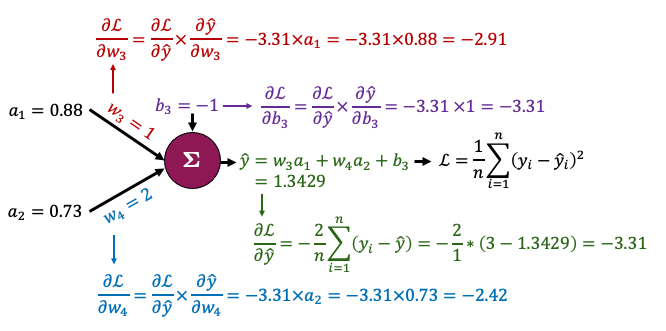

# 572 Quiz 2

## Backpropagation

### Basic concept

- It is to calculate the gradient of the loss function with respect to the weights
- It is a special case of the chain rule of calculus

- **Process:**

  1. Do "forward pass" to calculate the output of the network (prediction and loss)

  

  2. Do "backward pass" to calculate the gradients of the loss function with respect to the weights. Below is an example of reverse-mode autmatic differentiation (backpropagation):

  

### Torch: Autograd

- `torch.autograd` is PyTorch's automatic differentiation engine that powers neural network training

### Vanishing and Exploding Gradients

- Backpropagation can suffer from two problems because of multiple chain rule applications:
  - **Vanishing gradients**: the gradients of the loss function with respect to the weights become very small
    - 0 gradients because of underflow
  - **Exploding gradients**: the gradients of the loss function with respect to the weights become very large
- Possible solutions:
  - Use **ReLU** activation function: but it can also suffer from the dying ReLU problem (gradients are 0)
  - **Weight initialization**: initialize the weights with small values
  - **Batch normalization**: normalize the input layer by adjusting and scaling the activations
  - **Skip connections**: add connections that skip one or more layers
  - **Gradient clipping**: clip the gradients during backpropagation

### Training Neural Networks in PyTorch

#### Preventing Overfitting

- Add validation loss to the training loop
- **Early stopping**: if we see the validation loss is increasing, we stop training
  - Define a patience parameter: if the validation loss increases for `patience` epochs, we stop training
- **Regularization**: add a penalty term to the loss function to prevent overfitting
  - See [573 notes](https://mds.farrandi.com/block_3/573_model_sel/573_model_sel#regularization) for more details
  - `weight_decay` parameter in the optimizer
- **Dropout**: randomly set some neurons to 0 during training
  - It prevents overfitting by reducing the complexity of the model
  - `torch.nn.Dropout(0.2)`

### PyTorch Trainer Code

```python
import torch
import torch.nn as nn

def trainer(model, criterion, optimizer, trainloader, validloader, epochs=5, patience=5):
    """Simple training wrapper for PyTorch network."""

    train_loss = []
    valid_loss = []

    for epoch in range(epochs):  # for each epoch
        train_batch_loss = 0
        valid_batch_loss = 0

        # Training
        for X, y in trainloader:
            optimizer.zero_grad()       # Zero all the gradients w.r.t. parameters
            y_hat = model(X).flatten()  # Forward pass to get output
            loss = criterion(y_hat, y)  # Calculate loss based on output
            loss.backward()             # Calculate gradients w.r.t. parameters
            optimizer.step()            # Update parameters
            train_batch_loss += loss.item()  # Add loss for this batch to running total
        train_loss.append(train_batch_loss / len(trainloader))

        # Validation
        with torch.no_grad():  # this stops pytorch doing computational graph stuff under-the-hood and saves memory and time

            for X_valid, y_valid in validloader:
                y_hat = model(X_valid).flatten()  # Forward pass to get output
                loss = criterion(y_hat, y_valid)  # Calculate loss based on output
                valid_batch_loss += loss.item()
        valid_loss.append(valid_batch_loss / len(validloader))
    return train_loss, valid_loss
```

- Using the `trainer` function:

```python
import torch
import torch.nn
import torch.optim

torch.manual_seed(1)

model = network(1, 6, 1)
criterion = torch.nn.MSELoss()
optimizer = torch.optim.Adam(model.parameters(), lr=0.05) # weight_decay=0.01 for L2 regularization
train_loss, valid_loss = trainer(model, criterion, optimizer, trainloader, validloader, epochs=201, patience=3)

plot_loss(train_loss, valid_loss)
```

### Universal Approximation Theorem

- Any continuous function can be approximated arbitrarily well by a neural network with a single hidden layer
  - In other words, NN are universal function approximators

## Convolutional Neural Networks (CNN)


- Drastically reduces the number of params (compared to NN):
  - have activations depend on small number of inputs
  - same parameters (convolutional filter) are used for different parts of the image
- Can capture spatial information (preserves the structure of the image)

### Convolution

- Idea: use a small filter/kernel to extract features from the image
  - Filter: a small matrix of weights (normally odd dimensioned -> for symmetry)
- Notice that the filter results in a smaller output image
  - This is because we are not padding the image
  - We can add padding to the image to keep the same size
    - Padding: add zeros around the image
  - Can also add stride to move the filter more than 1 pixel at a time

### CNN Structure


_[img src](https://towardsdatascience.com/a-comprehensive-guide-to-convolutional-neural-networks-the-eli5-way-3bd2b1164a53)_

### CNN in PyTorch

#### 1. Convolutional Layer

```python
conv_1 = torch.nn.Conv2d(in_channels=1, out_channels=6, kernel_size=(3,3))
```

- Arguments:
  - `in_channels`: number of input channels (gray scale image has 1 channel, RGB has 3)
  - `out_channels`: number of output channels (similar to hidden nodes in NN)
  - `kernel_size`: size of the filter
  - `stride`: how many pixels to move the filter each time
  - `padding`: how many pixels to add around the image


- Size of input image (e.g. 256x256) doesn't matter, what matters is: `in_channels`, `out_channels`, `kernel_size`

$$\text{total params} = (\text{out channels} \times \text{in channels} \times \text{kernel size}^2) + \text{out channels}$$

$$\text{output size} = \frac{\text{input size} - \text{kernel size} + 2 \times \text{padding}}{\text{stride}} + 1$$

##### Dimensions of images and kernel tensors in PyTorch

- Images: `[batch_size, channels, height, width]`
- Kernel: `[out_channels, in_channels, kernel_height, kernel_width]`

#### 2. Flattening

- `feature learning` -> `classification`
- Use `torch.nn.Flatten()` to flatten the image
- At the end need to either do regression or classification

#### 3. Pooling

- Idea: reduce the size of the image
  - less params
  - less overfitting
- Common types:
  - **Max pooling**: take the max value in each region
    - Works well since it takes the sharpest features
  - **Average pooling**: take the average value in each region

#### Putting it all together

```python
class CNN(torch.nn.Module):
    def __init__(self):
        super().__init__()
        self.main = torch.nn.Sequential(

            torch.nn.Conv2d(in_channels=1,
                out_channels=3,
                kernel_size=(3, 3),
                padding=1),
            torch.nn.ReLU(), # activation function
            torch.nn.MaxPool2d((2, 2)),

            ...

            torch.nn.Flatten(),
            torch.nn.Linear(1250, 1)
        )

    def forward(self, x):
        out = self.main(x)
        return out
```

- Trainer code is the same as before

#### Using torchsummary

- To get a summary of the model
  - No need to manually calculate the output size of each layer

```python
from torchsummary import summary

model = CNN()
summary(model, (1, 256, 256))
```

### Preparing Data

#### Turning images to tensors

- Normally there are 2 steps:
  1. create a `dataset` object: the raw data
  2. create a `dataloader` object: batches the data, shuffles, etc.
- Use `torchvision` to load the data
  - `torchvision.datasets.ImageFolder`: loads images from folders
  - Assumes structure: `root/class_1/xxx.png`, `root/class_2/xxx.png`, ...

```python
import torch
from torchvision import datasets, transforms

IMAGE_SIZE = (256, 256)
BATCH_SIZE = 32

# create transform object
data_transforms = transforms.Compose([
    transforms.Resize(IMAGE_SIZE),
    transforms.ToTensor()
])

# create dataset object
train_dataset = datasets.ImageFolder(root='path/to/data', transform=data_transforms)

# create dataloader object
train_loader = torch.utils.data.DataLoader(
    train_dataset,          # our raw data
    batch_size=BATCH_SIZE,  # the size of batches we want the dataloader to return
    shuffle=True,           # shuffle our data before batching
    drop_last=False         # don't drop the last batch even if it's smaller than batch_size
)

# get a batch of data
images, labels = next(iter(train_loader))
```

#### Saving and loading PyTorch models

- [PyTorch documentation](https://pytorch.org/tutorials/beginner/saving_loading_models.html)
- Convention: `.pt` or `.pth` file extension

```python
PATH = "models/my_cnn.pt"

# load model
model = bitmoji_CNN() # must have defined the model class
model.load_state_dict(torch.load(PATH))
model.eval() # set model to evaluation mode (not training mode)

# save model
torch.save(model.state_dict(), PATH)
```

#### Data augmentation

- To make CNN more robust to different images + increase the size of the dataset
- Common augmentations:

  - Crop
  - Rotate
  - Flip
  - Color jitter

```python
data_transforms = transforms.Compose([
    transforms.Resize(IMAGE_SIZE),
    transforms.RandomVerticalFlip(p=0.5), # p=0.5 means 50% chance of applying this augmentation
    transforms.RandomHorizontalFlip(p=0.5),
    transforms.ToTensor()
])
```

### Hyperparameter Tuning

- NN has a lot of hyperparameters

  - Grid search will take a long time
  - Need a smarter approach: **Optimization Algorithms**

- Examples: Ax (we will use this), Raytune, Neptune, skorch.

### Transfer Learning

- Idea: use a pre-trained model and fine-tune it to our specific task
- Install from `torchvision.models`
  - All models have been trained on ImageNet dataset (224x224 images)
- See [here for code](https://pages.github.ubc.ca/MDS-2023-24/DSCI_572_sup-learn-2_students/lectures/07_cnns-pt2.html#using-pre-trained-models-out-of-the-box)

#### Approach 1: Adding layers to pre-trained model

```python
densenet = models.densenet121(weights='DenseNet121_Weights.DEFAULT')

for param in densenet.parameters():  # Freeze parameters so we don't update them
    param.requires_grad = False
# can fine-tune to freeze only some layers

list(densenet.named_children())[-1] # check the last layer

# update the last layer
new_layers = nn.Sequential(
    nn.Linear(1024, 500),
    nn.ReLU(),
    nn.Linear(500, 1)
)
densenet.classifier = new_layers
```

Then train the model as usual.

```python
densenet.to(device)
criterion = nn.BCEWithLogitsLoss()
optimizer = torch.optim.Adam(densenet.parameters(), lr=2e-3)
results = trainer(densenet, criterion, optimizer, train_loader, valid_loader, device, epochs=10)
```

#### Approach 2: Use Extracted Features in a New Model

- Idea:
  1. Take output from pre-trained model
  2. Feed output to a new model

## Advanced CNN

### Generative vs Discriminative Models

| Generative Models                                                         | Discriminative Models                                           |
| ------------------------------------------------------------------------- | --------------------------------------------------------------- |
| Directly model the joint probability distribution of the input and output | Model the conditional probability of the output given the input |
| Directly model $P(y\|x)$                                                  | Estimate $P(x\|y)$ to then deduce $P(y\|x)$                     |
| Build model for each class                                                | Make boundary between classes                                   |
| "Generate or draw a cat"                                                  | "Distinquish between cats and dogs"                             |
| Examples: Naibe bayes, ChatGPT                                            | Examples: Logistic Regression, SVM, Tree based models, CNN      |

### Autoencoders


- Designed to reconstruct the input
- Encoder and a decoder
- Why do we need autoencoders?
  - Dimensionality reduction
  - Denoising

#### Dimensionality Reduction

- Maybe the z axis is unimportant in the input space for classification
- Only use `encoder` part of the autoencoder

#### Denoising

- Remove noise from the input
- Use _Transposed Convolution Layers_ to upsample the input
  - Normal convolution: downsample (output is smaller than input)
  - Transposed convolution: upsample (output is larger than input)

## Generative Adversarial Networks (GANs)

- Model used to generate new data (indistinguishable from real data)
- No need for labels (unsupervised learning)
- See [here](https://developers.google.com/machine-learning/gan/gan_structure)


- Two networks:
  - Generator: creates new data
  - Discriminator: tries to distinguish between real and fake data
- "Adversarial" because both are battling each other:
  - Generator tries to create data that the discriminator can't distinguish from real data
  - Discriminator tries to distinguish between real and fake data

### Training GANs

1. Train the discriminator (simple binary classification)
   - Train the discriminator on real data
   - Train the discriminator on fake data (generated by the generator)
2. Train the generator
   - Generate fake images with the generator and label them as real
   - Pass to discriminator and ask it to classify them (real or fake)
   - Pass judgement to a loss function (see how far it is from the ideal output)
     - ideal output: all fake images are classified as real
     - high loss: discriminator is good at distinguishing between real and fake data
   - Do backpropagation and update the generator
3. Repeat

- **Goals**:

  - Discriminator loss goes to 0.5 (can't distinguish between real and fake data)
  - Generator loss goes to 0 (can generate data that looks like real data)

- **Notes**:
  - If discriminator is too good, the generator will never learn because there will be no opportunity to improve

### Pytorch Implementation

1. Creating the data loader

2. Creating the generator

   ```python

   class Generator(nn.Module):

    def __init__(self, LATENT_SIZE):
        super(Generator, self).__init__()

        self.main = nn.Sequential(
            nn.ConvTranspose2d(LATENT_SIZE, 1024, kernel_size=4, stride=1, padding=0, bias=False),
            nn.BatchNorm2d(1024),
            nn.LeakyReLU(0.2, inplace=True),

        ...

            nn.ConvTranspose2d(128, 3, kernel_size=4, stride=2, padding=1, bias=False),
            nn.BatchNorm2d(3),

            nn.Tanh()
        )

    def forward(self, input):
        return self.main(input)
   ```

3. Creating the discriminator (Always a binary classifier)

4. Instantiating the models

   ```python
   LATENT_SIZE = 100
   generator = Generator(LATENT_SIZE).to(device)
   discriminator = Discriminator().to(device)

   criterion = nn.BCELoss()

   optimizerG = optim.Adam(generator.parameters(), lr=0.001, betas=(0.5, 0.999))
   optimizerD = optim.Adam(discriminator.parameters(), lr=0.001, betas=(0.5, 0.999))

    def weights_init(m):
        if isinstance(m, (nn.Conv2d, nn.ConvTranspose2d)):
            nn.init.normal_(m.weight.data, 0.0, 0.02)
        elif isinstance(m, nn.BatchNorm2d):
            nn.init.normal_(m.weight.data, 1.0, 0.02)
            nn.init.constant_(m.bias.data, 0)


    generator.apply(weights_init)
    discriminator.apply(weights_init);
   ```

5. Training the GAN

6. Visualize training process

### Multi-Input Networks

```python
class multiModel(nn.Module):
    def __init__(self):
        super().__init__()
        ...

    def forward(self, image, data):
        x_cnn = self.cnn(image) # 1st model: CNN
        x_fc = self.fc(data) # 2nd model: Fully connected
        return torch.cat((x_cnn, x_fc), dim=1) # concatenate the two outputs
```
